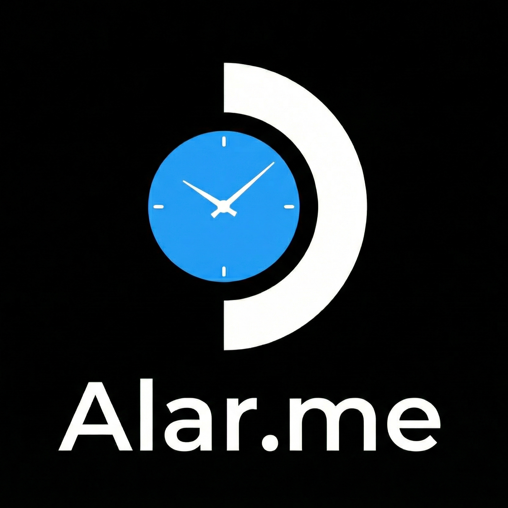

# Alar.me - Decky Loader Plugin

An advanced alarm and timer plugin for Steam Deck with persistent alarms, snooze functionality, Pomodoro productivity timer, and customizable sounds.




## Features

### ⏱️ Timers
- **Multiple concurrent timers** - Run several timers at once
- **Quick presets** - Start timers with one click (5, 10, 15, 30, 60 minutes)
- **Custom labels** - Name your timers for easy identification
- **Recent timers** - Quick access to your last 5 used timers
- **Persistent** - Timers survive Decky Loader restarts
- **Auto-suspend** - Optionally suspend the device when timer completes

### 🔔 Alarms
- **Time-based alarms** - Set alarms for specific times
- **Intuitive time picker** - Easy hour/minute selection with arrow controls
- **Recurring patterns** - Once, Daily, Weekdays, Weekends
- **Snooze functionality** - Configurable snooze duration (1-30 minutes)
- **Per-alarm settings** - Individual subtle mode and auto-suspend options
- **Persistent** - Alarms survive device reboots

### 🍅 Pomodoro Timer
- **Focus mode** - Customizable work duration (15-60 minutes)
- **Break intervals** - Short breaks (3-15 min) and long breaks (10-45 min)
- **Session tracking** - Configurable sessions until long break (2-8)
- **Comprehensive Statistics** - Track daily and lifetime focus time, sessions, and cycles.
- **Visual progress** - See your focus progress at a glance
- **Skip controls** - Skip to break or back to work anytime
- **Background persistence** - Timer continues running even if you close the menu
- **Reset Stats** - Option to wipe your history and start fresh

### 💾 Data Management
- **Backup & Restore** - Export your settings, alarms, timers, and stats to a file.
- **Easy Migration** - Move your data between devices or restore after re-install.

### 🔊 Sound Options
- **Per-feature sounds** - Different sounds for Timers, Alarms, and Pomodoro
- **Soundless mode** - Silent alarm option for quiet notifications
- **Volume control** - Adjust alarm volume independently per feature
- **Custom sounds** - Add your own MP3, WAV, or OGG files

### ⚙️ Settings
- **Subtle mode** - Choose between fullscreen alerts or small toasts
- **Auto-suspend** - Automatically suspend the device after alert (enables subtle mode)
- **24/12 hour format** - Choose your preferred time display
- **Global volume control** - Per-feature volume settings

## Installation

### From Decky Store (Soon!)
1. Open Decky Loader on your Steam Deck
2. Go to the Store tab
3. Search for "Alar.me"
4. Click Install

### Manual Installation
1. Download the latest release from the [Releases](https://github.com/lemossilva/alarme-decky-plugin/releases) page
2. Open Decky Loader > Settings > General > "Install from Zip" > Select the Zip release file (not source code!).
3. Restart Decky Loader

## Adding Custom Sounds

1. Place your sound files (`.mp3`, `.wav`, or `.ogg`) in the `assets/` folder
2. Rebuild and redeploy the plugin
3. The sounds will appear in the Settings panel dropdowns

## Development

### Prerequisites

```bash
# Install Node.js 18+
curl -fsSL https://deb.nodesource.com/setup_18.x | sudo -E bash -
sudo apt-get install -y nodejs

# Install pnpm v9
sudo npm install -g pnpm@9

# Verify
node --version  # Should be 18.x+
pnpm --version  # Should be 9.x
```

### Building

```bash
# Install dependencies
pnpm install

# Build for production
pnpm run build

# Watch mode for development
pnpm run watch
```

### Deploying to Steam Deck

1. Enable SSH on your Steam Deck (Desktop Mode)
2. Deploy:
   ```bash
   ./deploy.sh 192.168.X.X
   ```

### CEF Debugging

1. Enable "Allow Remote CEF Debugging" in Decky Developer Settings
2. Open Chrome/Edge and go to `chrome://inspect`
3. Configure network target: `DECK_IP:8081`
4. Select "SharedJSContext" to debug

## Privacy

This plugin is **completely offline** and collects no data:
- All settings stored locally on your device
- No network requests or analytics
- No user tracking or telemetry


## License

BSD-3-Clause License - See [LICENSE](LICENSE) for details.

## Credits

- **Author**: Guilherme Lemos
- **Inspiration**: [simple-timer](https://github.com/decktools-xyz/simple-timer)
- **Framework**: [Decky Loader](https://github.com/SteamDeckHomebrew/decky-loader)
- **Icons**: [React Icons](https://react-icons.github.io/react-icons/)

## Support

If you encounter any issues, please [open an issue](https://github.com/lemossilva/alarme-decky-plugin/issues) on GitHub.


