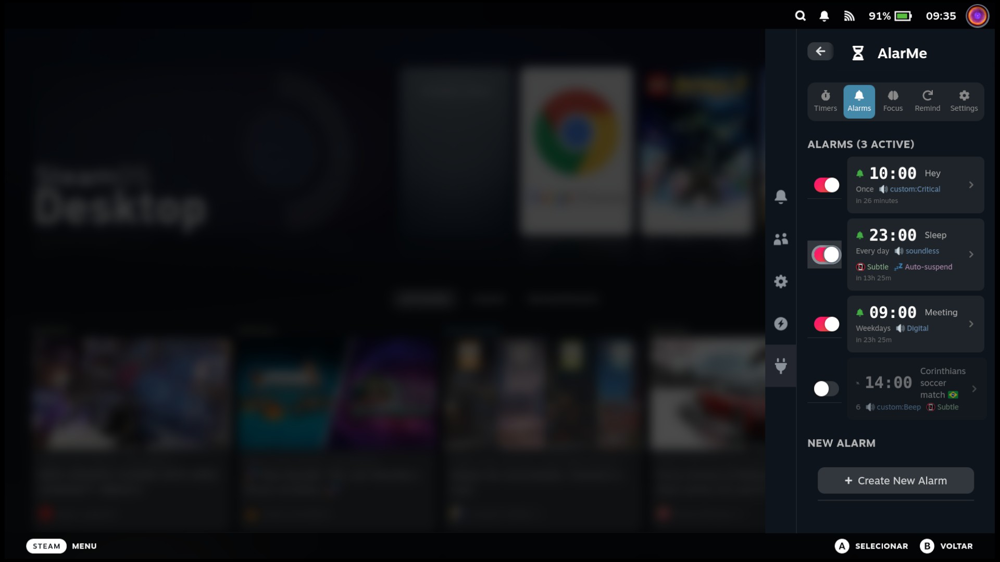
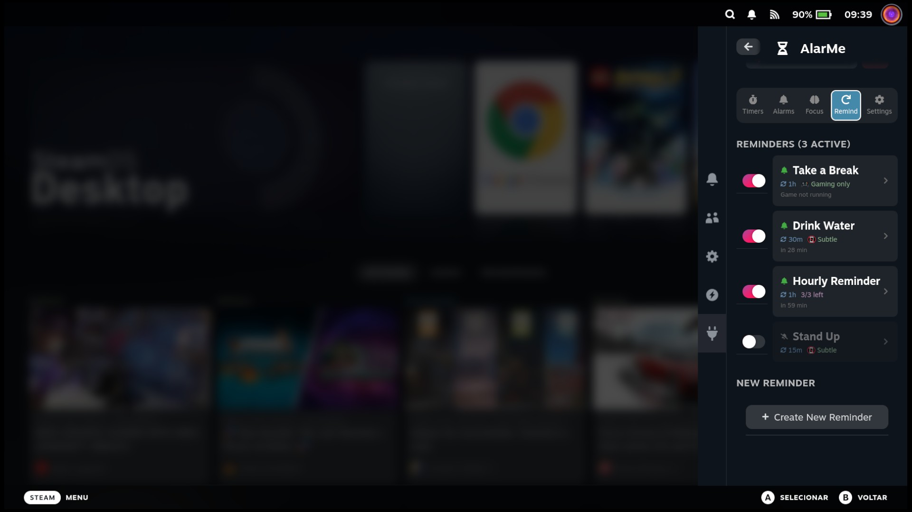
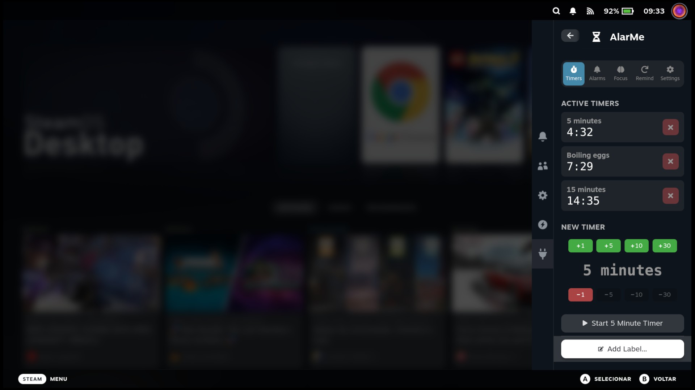
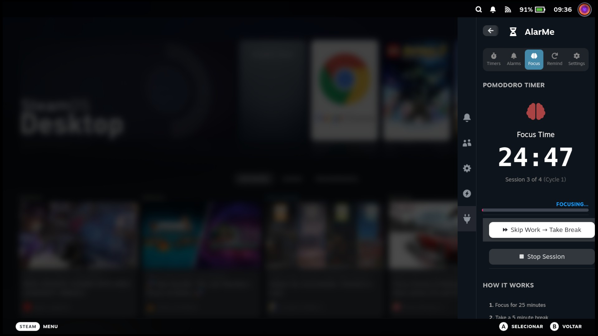
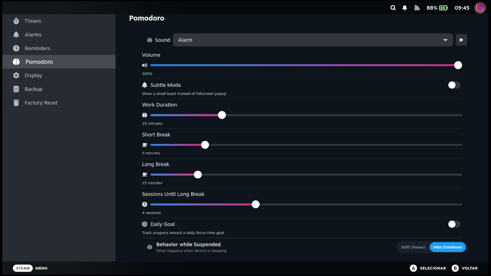
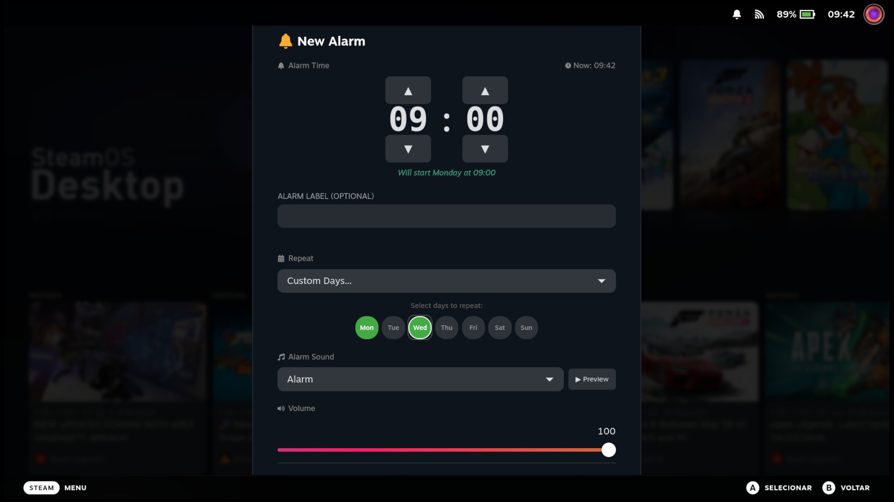
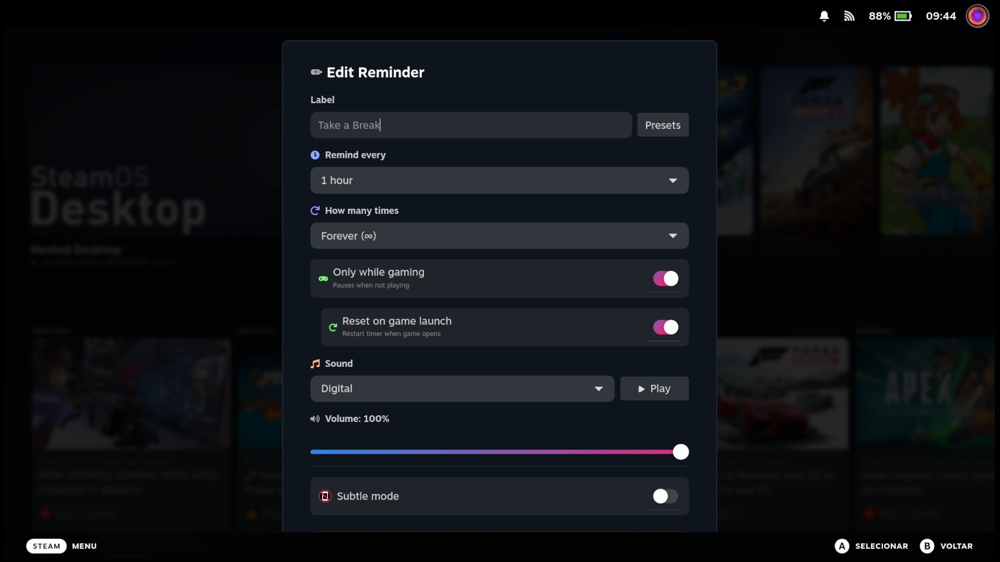
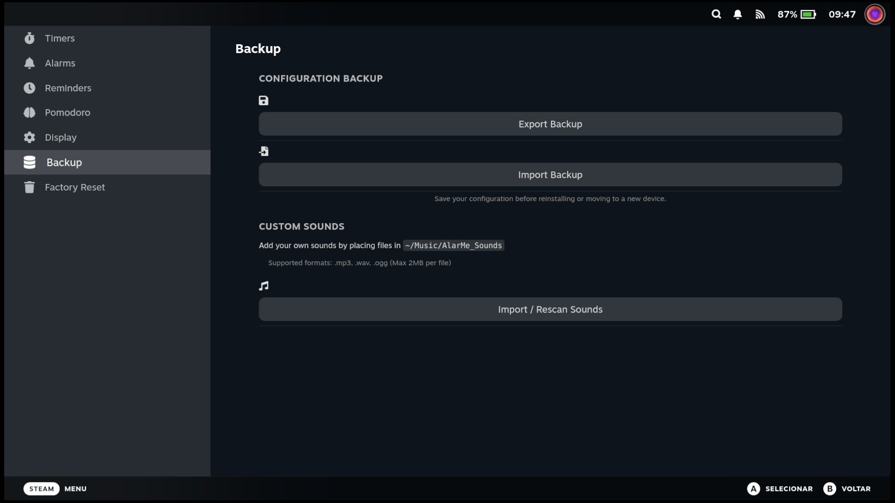
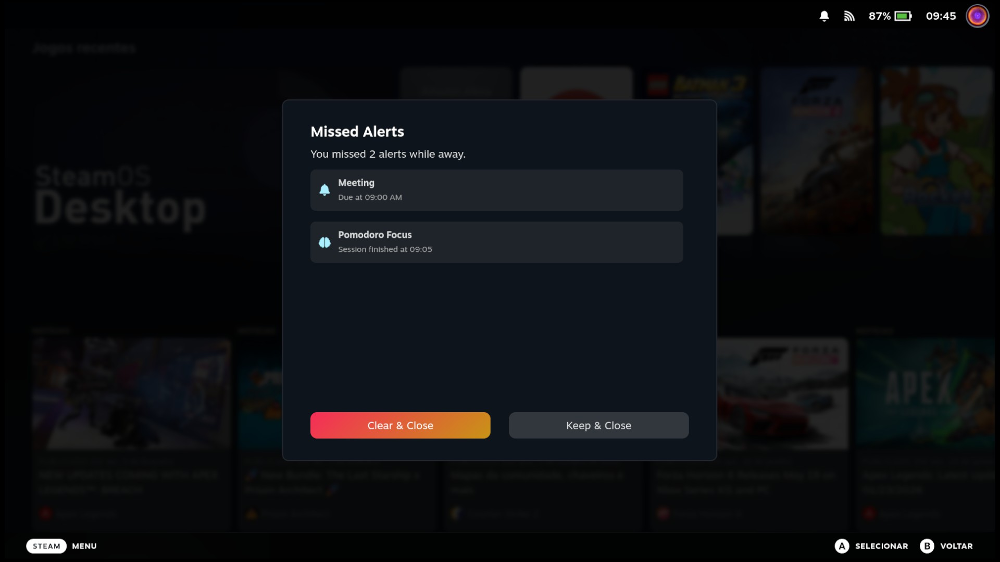

# AlarMe - Decky Loader Plugin

An advanced alarm and timer plugin for Steam Deck with persistent alarms, snooze functionality, Pomodoro productivity timer, and customizable sounds.


## Features

### ⏱️ Stopwatch
- **Precision tracking** - Keep track of elapsed time up to centiseconds
- **Lap support** - Record and copy up to 50 laps per session
- **In-game overlay** - View your running stopwatch directly in the Steam performance overlay
- **Auto-reset** - Option to automatically reset the stopwatch when closed
- **Background execution** - Stopwatch continues running even if the plugin is closed

### ⏳ Timers
- **Multiple concurrent timers** - Run several timers at once
- **Saved presets** - Save any timer as a custom preset, manage your list, and start timers with one click
- **Custom labels** - Name your timers for easy identification
- **Recent timers** - Quick access to your last 5 used timers
- **Persistent** - Timers survive Decky Loader restarts
- **Auto-suspend** - Optionally suspend the device when timer completes

### 🔔 Alarms
- **Time-based alarms** - Set alarms for specific times
- **Intuitive time picker** - Easy hour/minute selection with arrow controls
- **Recurring patterns** - Once, Daily, Weekdays, Weekends
- **Snooze functionality** - Configurable snooze duration (1-30 minutes)
- **Per-alarm settings** - Individual subtle mode and auto-suspend options
- **Persistent** - Alarms survive device reboots

### 🍅 Pomodoro Timer
- **Focus mode** - Customizable work duration (15-60 minutes)
- **Break intervals** - Short breaks (3-15 min) and long breaks (10-45 min)
- **Session tracking** - Configurable sessions until long break (2-8)
- **Comprehensive Statistics** - Track daily and lifetime focus time, sessions, and cycles.
- **Visual progress** - See your focus progress at a glance
- **Skip controls** - Skip to break or back to work anytime
- **Background persistence** - Timer continues running even if you close the menu
- **Reset Stats** - Option to wipe your history and start fresh

### 🔁 Periodic Reminders
- **Recurring Alerts** - Set reminders that repeat every X minutes (e.g., "Drink Water" every 30 mins)
- **Gaming Mode** - Smart reminders that only tick while a game is running
- **App Detection** - Automatically detects active games
- **Start Delay** - Option to delay the first reminder
- **Limit Recurrence** - Stop after a set number of repeats

### 💾 Data Management
- **Backup & Restore** - Export your settings, alarms, timers, and stats to a file.
- **Easy Migration** - Move your data between devices or restore after re-install.

### 🔊 Sound Options
- **Per-feature sounds** - Different sounds for Timers, Alarms, and Pomodoro
- **Soundless mode** - Silent alarm option for quiet notifications
- **Volume control** - Adjust alarm volume independently per feature
- **Custom sounds** - Import your own MP3, WAV, or OGG files from `~/Music/AlarMe_Sounds`
- **Folder sync** - Rescan to add new sounds or remove deleted ones

### ⚙️ Settings
- **Prevent Sleep Mode** - Keep the Steam Deck awake while you have active timers, alarms, or pomodoro sessions. Uses native inputs so it works seamlessly in Game Mode.
- **Subtle mode** - Choose between fullscreen alerts or small toasts
- **Auto-suspend** - Automatically suspend the device after alert (enables subtle mode)
- **24/12 hour format** - Choose your preferred time display
- **Global volume control** - Per-feature volume settings

### 🎮 In-Game Overlay
- **Easy check** - Quickly see your alarms and timers
- **Native Integration** - Fits seamlessly into SteamOS UI
- **Non-Intrusive** - Horizontal micro-alerts that won't block game UI

> **Note**: The overlay appears when you open the Quick Access Menu (•••) or Steam Menu. It uses the empty black bar space reserved by SteamOS to display your upcoming alarms and timers without obstructing any interface elements.

## Screenshots

<details>
<summary>📸 Click to view screenshots</summary>

### 🔔 Alarms & Reminders

*Manage multiple alarms with ease.*


*Keep track of your recurring reminders.*

### ⏱️ Quick Timers

*One-tap presets and custom timers.*

### 🍅 Pomodoro Focus

*Stay focused with the built-in Pomodoro timer.*


*Customize your pomodoro however you like. Daily focus time and stats available*

### 📝 Easy Configuration

*Detailed settings for every alarm.*


*Set periodic reminders like "Hydration Check" every 45 mins.*

### ⚙️ Customizable Settings

*New dedicated Settings Modal with Sound Manager and Backup options.*

### 🚨 Missed Alerts

*See what you missed while your Deck was asleep.*

</details>

## Installation

### From Decky Store
1. Open Decky Loader on your Steam Deck
2. Go to the Store tab
3. Search for "AlarMe"
4. Click Install

### Manual Installation
1. Download the latest release from the [Releases](https://github.com/lemossilva/alarme-decky-plugin/releases) page
2. Open Decky Loader > Settings > General > "Install from Zip" > Select the Zip release file (not source code!).
3. Restart Decky Loader

## Adding Custom Sounds

1. Go to Desktop Mode.
2. Create a folder named `AlarMe_Sounds` in your Music folder (`~/Music/AlarMe_Sounds`).
3. Place your sound files (`.mp3`, `.wav`, or `.ogg`, max 2MB) in this folder.
4. Return to Gaming Mode > AlarMe > Settings.
5. Scroll down to "**Custom Sounds**" and click "**Import Sounds**".
6. Your sounds will now appear in the sound picker lists!

## Development

### Prerequisites

```bash
# Install Node.js 18+
curl -fsSL https://deb.nodesource.com/setup_18.x | sudo -E bash -
sudo apt-get install -y nodejs

# Install pnpm v9
sudo npm install -g pnpm@9

# Verify
node --version  # Should be 18.x+
pnpm --version  # Should be 9.x
```

### Building

```bash
# Install dependencies
pnpm install

# Build for production
pnpm run build

# Watch mode for development
pnpm run watch
```

### Deploying to Steam Deck

1. Enable SSH on your Steam Deck (Desktop Mode)
2. Deploy:
   ```bash
   ./deploy.sh 192.168.X.X
   ```

### CEF Debugging

1. Enable "Allow Remote CEF Debugging" in Decky Developer Settings
2. Open Chrome/Edge and go to `chrome://inspect`
3. Configure network target: `DECK_IP:8081`
4. Select "SharedJSContext" to debug

## Privacy

This plugin is **completely offline** and collects no data:
- All settings stored locally on your device
- No network requests or analytics
- No user tracking or telemetry


## License

BSD-3-Clause License - See [LICENSE](LICENSE) for details.

## Credits

- **Author**: Guilherme Lemos
- **Inspiration**: [simple-timer](https://github.com/decktools-xyz/simple-timer)
- **Periodic Reminders Inspiration**: [DeckyHourNotifications](https://github.com/mpcallahan/DeckyHourNotifications) by [@mpcallahan](https://github.com/mpcallahan)
- **Framework**: [Decky Loader](https://github.com/SteamDeckHomebrew/decky-loader)
- **Icons**: [React Icons](https://react-icons.github.io/react-icons/)

## Support

If you encounter any issues, please [open an issue](https://github.com/lemossilva/alarme-decky-plugin/issues) on GitHub.


